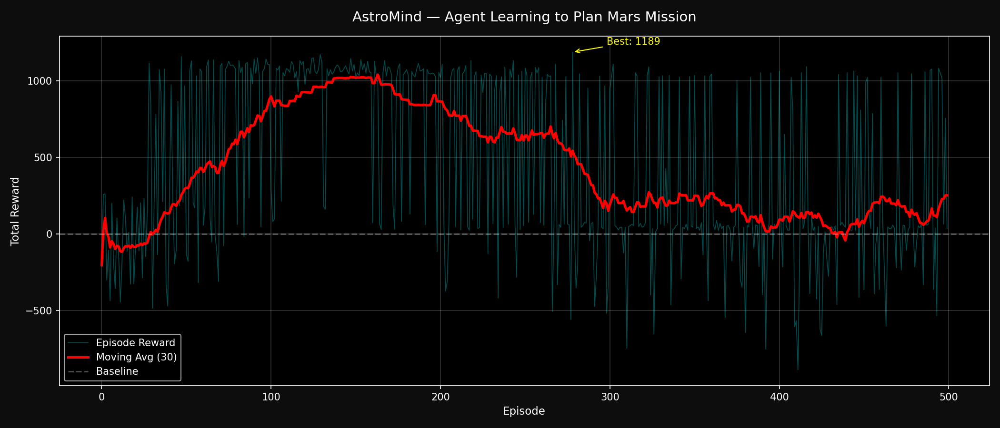

# 🚀 AstroMind — Mars Mission RL Environment

Built for **Meta × PyTorch × HuggingFace OpenEnv Hackathon** at Scaler School of Technology, Bangalore (April 25-26, 2026).

## What is AstroMind?

An **OpenEnv-compatible** RL environment where an LLM agent must autonomously pilot a Mars mission across 300 days and 7 phases. The agent manages 4 critical resources — fuel, oxygen, power, and hull integrity — while navigating random space hazards (solar storms, micrometeorites) and completing mission objectives.

This tests **genuine long-horizon planning**: decisions made on Day 1 affect survival on Day 280.

## Quick Start

```bash
# Install the package
pip install -e .

# Terminal 1: Start the environment server
uvicorn server.app:app --reload --port 8000

# Terminal 2: Launch the Mission Control dashboard
streamlit run dashboard.py

# Terminal 3: Run baseline training
python train.py
```

## Environment Details

| Property | Value |
|---|---|
| Actions | 7 discrete commands |
| Observation space | 15 fields |
| Max episode length | 300 steps |
| Success condition | Complete all 7 phases + collect 3 samples |

### Mission Phases (must be completed in order)

1. 🚀 **Launch** — Lift off from Earth
2. 🌍 **Earth Orbit** — Achieve stable orbit
3. ⭐ **Transit** — Hohmann transfer to Mars (longest phase)
4. 🔴 **Mars Orbit** — Orbital insertion at Mars
5. 🛸 **Landing** — Descent to Mars surface
6. 🪨 **Surface Ops** — Collect 3 surface samples
7. 🏠 **Return** — Journey back to Earth

### Actions

| Command | Effect |
|---|---|
| `fire_thruster` | Burn fuel to reduce distance to target |
| `enter_orbit` | Attempt orbital insertion (phase-dependent) |
| `deploy_lander` | Deploy lander from Mars orbit |
| `collect_sample` | Collect surface sample during surface_ops |
| `run_diagnostics` | Repair hull (+5%) and recharge power (+3%) |
| `communicate_earth` | Send signal (informational) |
| `emergency_abort` | Abort the mission immediately |

## Reward Structure

| Event | Reward |
|---|---|
| Mission success | +500 |
| Sample collected | +30 each |
| Phase progression | +30 to +80 |
| Thruster fired | +10 |
| Diagnostics run | +5 |
| Oxygen depleted | -200 |
| Hull lost | -200 |
| Fuel exhausted | -150 |
| Duration exceeded | -50 |
| Emergency abort | -100 |
| Invalid action | -5 to -15 |

## Architecture

```
astromind/
├── models.py              # Pydantic action/observation models
├── reward.py              # Reward shaping utilities
├── server/
│   ├── __init__.py
│   ├── astro_environment.py  # OpenEnv Environment implementation
│   └── app.py             # FastAPI app entry point
├── client/
│   ├── __init__.py
│   └── astro_client.py    # OpenEnv HTTPEnvClient implementation
├── train.py               # Baseline training script
├── dashboard.py           # Streamlit Mission Control dashboard
├── pyproject.toml         # Package configuration
└── README.md
```

## OpenEnv Compliance

AstroMind follows the official OpenEnv specification:

- **Server**: `AstroEnvironment` extends `Environment` from `openenv.core.env_server`
- **FastAPI app**: Created via `create_fastapi_app(env, AstroAction, AstroObservation)`
- **Client**: `AstroEnvClient` extends `HTTPEnvClient` from `openenv_core`
- **Interface**: `reset()` → Observation, `step(action)` → Observation, `state` → dict

## Training Results



## Hackathon Integration

The rule-based agent in `train.py` serves as a baseline. Replace it with an LLM agent trained via TRL:

```python
from trl import PPOTrainer, PPOConfig
# Train your LLM agent against the AstroMind environment
```
